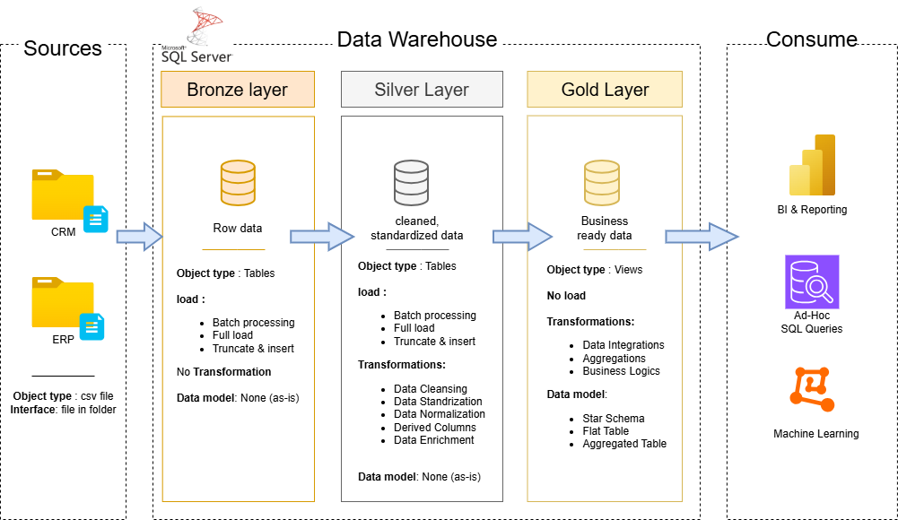

## 🏗️ Data Architecture

The project is built using the Medallion Architecture approach, which organizes data into three main layers:

### 🥉 Bronze Layer
- Stores raw data as received from source systems  
- Data is ingested from CSV files into SQL Server  
- No transformations are applied  

### 🥈 Silver Layer
- Data cleaning and preprocessing  
- Handling missing values and duplicates  
- Standardization and normalization  

### 🥇 Gold Layer
- Contains business-ready data  
- Structured using Star Schema  
- Optimized for reporting  

---
## 📖 Project Overview

This project includes:

- **Data Architecture**  
  Designing a modern data warehouse  

- **ETL Pipelines**  
  Extracting, transforming, and loading data  

- **Data Modeling**  
  Creating fact and dimension tables  

- **Analytics & Reporting**  
  Writing SQL queries and building dashboards  
